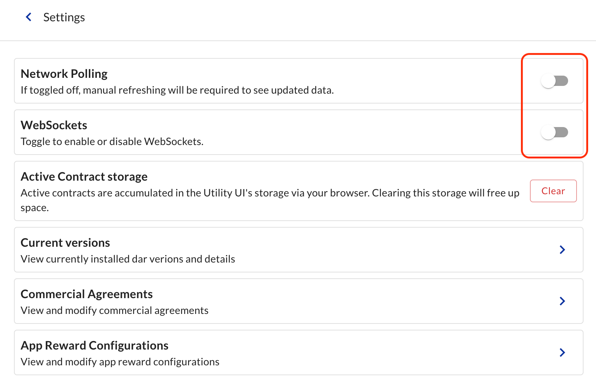

# Testnet Issuance #2 - January xxx, 2025 <!-- omit in toc -->

## Table of Contents <!-- omit in toc -->

- [Documentation](#documentation)
- [URLs \& Versions](#urls--versions)
- [PartyIDs](#partyids)
- [Status](#status)
  - [Step 0: Infrastructure Setup](#step-0-infrastructure-setup)
  - [Step 1: Onboarding roles](#step-1-onboarding-roles)
  - [Step 2: Configuring tokens](#step-2-configuring-tokens)
  - [Step 3: Issuing tokens](#step-3-issuing-tokens)
  - [Step 4: Transfering tokens](#step-4-transfering-tokens)
- [Detailed instructions](#detailed-instructions)
  - [0.1 Setup BR node](#01-setup-br-node)
  - [0.2 Setup SGF node](#02-setup-sgf-node)
  - [0.3 Setup Investor1 node](#03-setup-investor1-node)
  - [0.4 Setup Investor2 node](#04-setup-investor2-node)
  - [1.1 Credential User Service for all entities](#11-credential-user-service-for-all-entities)
  - [1.2 Provider credential](#12-provider-credential)
  - [1.3 Provider onboarding](#13-provider-onboarding)
  - [1.4 Provider configuration](#14-provider-configuration)
  - [1.5 Registrar credential](#15-registrar-credential)
  - [1.6 Registrar onboarding](#16-registrar-onboarding)
  - [2.1 Registrar creates Allocation Factory and Transfer Rule](#21-registrar-creates-allocation-factory-and-transfer-rule)
  - [2.2 Registrar specifies Instrument Configuration](#22-registrar-specifies-instrument-configuration)
    - [EURCV Instrument Configuration](#eurcv-instrument-configuration)
    - [USDCV Instrument Configuration](#usdcv-instrument-configuration)
  - [2.3 Registrar offers credentials to Issuer and Holders](#23-registrar-offers-credentials-to-issuer-and-holders)
    - [Credential to issue EURCV](#credential-to-issue-eurcv)
    - [Credentials to hold EURCV](#credentials-to-hold-eurcv)
    - [Credential to issue USDCV](#credential-to-issue-usdcv)
    - [Credentials to hold USDCV](#credentials-to-hold-usdcv)
  - [3.1 Issuer requests token issuance (minting)](#31-issuer-requests-token-issuance-minting)
    - [EUR10m EURCV issued](#eur10m-eurcv-issued)
    - [USD10m USDCV issued](#usd10m-usdcv-issued)
  - [3.2 Registrar accepts and tokens are issued](#32-registrar-accepts-and-tokens-are-issued)
  - [3.3 Issuer offers token transfer to Investor1](#33-issuer-offers-token-transfer-to-investor1)
    - [EUR10m EURCV minted to Investor1](#eur10m-eurcv-minted-to-investor1)
    - [USD10m USDCV minted to Investor1](#usd10m-usdcv-minted-to-investor1)
  - [3.4 Investor1 accepts transfer](#34-investor1-accepts-transfer)
  - [4.1 Investor1 offers token transfer to Investor2](#41-investor1-offers-token-transfer-to-investor2)
    - [EUR3m EURCV transfer from Investor1 to Investor2](#eur3m-eurcv-transfer-from-investor1-to-investor2)
    - [USD3m USDCV transfer from Investor1 to Investor2](#usd3m-usdcv-transfer-from-investor1-to-investor2)
  - [4.2 Investor2 accepts transfer](#42-investor2-accepts-transfer)
- [Test 'freeze asset' feature](#test-freeze-asset-feature)

## Documentation

- [Issuing Tokenized Instruments](https://docs.digitalasset.com/utilities/testnet/tutorials/issuance/introduction.html)
- [Transfering Tokenized Instruments](https://docs.digitalasset.com/utilities/testnet/tutorials/transfer/index.html)
- [Redeeming Tokenized Instruments](https://docs.digitalasset.com/utilities/testnet/tutorials/redemption/index.html)

## URLs & Versions

| Entity               | Details                                                                                 | Utility UI version |
| :------------------- | :-------------------------------------------------------------------------------------- | ------------------ |
| Broadridge (BR)      | https://utility-broadridge.test.broadridge.catalyst.intellecteu.io                      | 0.10.16            |
| SG Forge (Registrar) | https://utility-socgen.test.broadridge.catalyst.intellecteu.io                          | 0.10.16            |
| SG Forge (Issuer)    | https://utility-socgen.test.broadridge.catalyst.intellecteu.io                          | 0.10.16            |
| Investor1            | https://validator-pool-001-utility.utility.cnu.testnet.da-int.net/credential/onboarding | 0.10.16            |
| Investor2            | https://validator-pool-001-utility.utility.cnu.testnet.da-int.net/credential/onboarding | 0.10.16            |

## PartyIDs

| Entity               | Party ID                                                                                                   |
| :------------------- | :--------------------------------------------------------------------------------------------------------- |
| Broadridge           | `broadridge-provider::1220992258bad53ba6cb1aa634bb912d457f3e0382892ced2d00b4cac654e6e52259`                |
| SG Forge (Registrar) | `sgforge::12206c7de045405eb47f7ecfb1fa82665672664e4b9ab350b7064ef7bceb8bc8cbe3`                            |
| SG Forge (Issuer)    | `sgforge-issuer::12206c7de045405eb47f7ecfb1fa82665672664e4b9ab350b7064ef7bceb8bc8cbe3`                     |
| Investor1            | `auth0_007c692dafd3a671ed48e985f245::1220f36652a7487f93853ac8dcc7ed9e64c32c7caebf8c715e83c8581dba855a37ca` |
| Investor2            | `auth0_007c692dafef3d5476ff3ddd16e8::1220f36652a7487f93853ac8dcc7ed9e64c32c7caebf8c715e83c8581dba855a37ca` |

## Status

### Step 0: Infrastructure Setup

| Steps                                                | IEU  | BR   | SGF  | SGF-Issuer | Investor1 | Investor2 |
| :--------------------------------------------------- | :--- | :--- | :--- | :--------- | :-------- | :-------- |
| [0.1 Setup BR node](#01-setup-br-node)               | ✅    | ✅    | -    | -          | -         | -         |
| [0.2 Setup SGF node](#02-setup-sgf-node)             | ✅    | -    | ✅    | ✅          | -         | -         |
| [0.3 Setup Investor1 node](#03-setup-investor1-node) | -    | -    | -    | -          | ✅         | -         |
| [0.4 Setup Investor2 node](#04-setup-investor2-node) | -    | -    | -    | -          | -         | ✅         |

### Step 1: Onboarding roles

| Steps                                                                                        | DA   | BR   | SGF  | SGF-Issuer | Investor1 | Investor2 |
| :------------------------------------------------------------------------------------------- | :--- | :--- | :--- | :--------- | :-------- | :-------- |
| [1.1 Credential User Service for all entities](#11-credential-user-service-for-all-entities) | -    | ✅    | ✅    | 📌          | ✅         | ✅         |
| [1.2 Provider credential](#12-provider-credential)                                           | ✅    | ✅    | -    | -          | -         | -         |
| [1.3 Provider onboarding](#13-provider-onboarding)                                           | ✅    | ✅    | -    | -          | -         | -         |
| [1.4 Provider configuration](#14-provider-configuration)                                     | -    | ✅    | -    | -          | -         | -         |
| [1.5 Registrar credential](#15-registrar-credential)                                         | -    | ✅    | ✅    | -          | -         | -         |
| [1.6 Registrar onboarding](#16-registrar-onboarding)                                         | -    | ✅    | ✅    | -          | -         | -         |

### Step 2: Configuring tokens

| Steps                                                                                                                    | DA   | BR   | SGF  | SGF-Issuer | Investor1 | Investor2 |
| :----------------------------------------------------------------------------------------------------------------------- | :--- | :--- | :--- | :--------- | :-------- | :-------- |
| [2.1 Registrar creates Allocation Factory and Transfer Rule](#21-registrar-creates-allocation-factory-and-transfer-rule) | -    | -    | ✅    | -          | -         | -         |
| [2.2 Registrar specifies Instrument Configuration](#22-registrar-specifies-instrument-configuration)                     | -    | -    | ✅    | -          | -         | -         |
| [2.3 Registrar offers credentials to Issuer and Holders](#23-registrar-offers-credentials-to-issuer-and-holders)         | -    | -    | ✅    | 📌          | ✅         | 📌         |

### Step 3: Issuing tokens

| Steps                                                                                          | DA   | BR   | SGF  | SGF-Issuer | Investor1 | Investor2 |
| :--------------------------------------------------------------------------------------------- | :--- | :--- | :--- | :--------- | :-------- | :-------- |
| [3.1 Issuer requests token issuance (minting)](#31-issuer-requests-token-issuance-minting)     | -    | -    |      | 📌          | -         | -         |
| [3.2 Registrar accepts and tokens are issued](#32-registrar-accepts-and-tokens-are-issued)     | -    | -    | 📌    | -          | -         | -         |
| [3.3 Issuer offers token transfer to Investor1](#33-issuer-offers-token-transfer-to-investor1) | -    | -    | -    | 📌          | -         | -         |
| [3.4 Investor1 accepts transfer](#34-investor1-accepts-transfer)                               | -    | -    | -    | -          | 📌         | -         |

### Step 4: Transfering tokens

| Steps                                                                                                | DA   | BR   | SGF  | SGF-Issuer | Investor1 | Investor2 |
| :--------------------------------------------------------------------------------------------------- | :--- | :--- | :--- | :--------- | :-------- | :-------- |
| [4.1 Investor1 offers token transfer to Investor2](#41-investor1-offers-token-transfer-to-investor2) | -    | -    | -    | -          | 📌         | -         |
| [4.2 Investor2 accepts transfer](#42-investor2-accepts-transfer)                                     | -    | -    | -    | -          | -         | 📌         |

## Detailed instructions

### 0.1 Setup BR node

IEU setup BR node on testnet:

- url: https://utility-broadridge.broadridge.catalyst.intellecteu.io
- DA CN Utility version: 0.10.16
- partyIDs: `broadridge-provider::1220992258bad53ba6cb1aa634bb912d457f3e0382892ced2d00b4cac654e6e52259`
- access credentials shared securely

BR confirms that they are able to access (no IP restriction issues, no firewall issues, no polling issues).

BR turns off `Network Polling` and `Websockets` to avoid potential corporate firewall issues.

### 0.2 Setup SGF node

IEU setup SGF node on testnet:

- url: https://utility-socgen.broadridge.catalyst.intellecteu.io
- DA CN Utility version: 0.10.16
- partyIDs:
  - `sgforge::12203e601bb3021da99f2105b460ef92f083faf716377991a636c52b11bda56c6cf1`
  - `sgforge-issuer::12206c7de045405eb47f7ecfb1fa82665672664e4b9ab350b7064ef7bceb8bc8cbe3`
- access credentials shared securely

SGF (Registar) and SGF (Issuer) confirm that they are able to access (no IP restriction issues, no firewall issues).

### 0.3 Setup Investor1 node

Investor1 setup node on testnet:

- url: https://validator-pool-001-utility.utility.cnu.testnet.da-int.net/credential/onboarding
- DA CN Utility version: 0.10.16
- partyIDs: `auth0_007c692dafd3a671ed48e985f245::1220f36652a7487f93853ac8dcc7ed9e64c32c7caebf8c715e83c8581dba855a37ca`
- access credentials shared securely

Investor1 confirms that they are able to access.

### 0.4 Setup Investor2 node

Investor2 setup node on testnet:

- url: https://validator-pool-001-utility.utility.cnu.testnet.da-int.net/credential/onboarding
- DA CN Utility version: 0.10.16
- partyIDs: `auth0_007c692dafef3d5476ff3ddd16e8::1220f36652a7487f93853ac8dcc7ed9e64c32c7caebf8c715e83c8581dba855a37ca`
- access credentials shared securely

Investor1 confirms that they are able to access.

### 1.1 Credential User Service for all entities

| Actor        | Module     | Tab        |
| :----------- | :--------- | :--------- |
| All entities | Credential | Onboarding |

All entities `Request Credential User Service`.

See [tutorial](https://docs.digitalasset.com/utilities/testnet/tutorials/issuance/1-onboarding.html#onboarding-credential-services-for-all-entities) for details.

### 1.2 Provider credential

| Actors | Module     | Tab                 |
| :----- | :--------- | :------------------ |
| DA, BR | Credential | Credentials, Offers |

DA offers Provider credential (Credentials tab), and BR accepts it (Offers tab):

| Item        | Value                                                                                       |
| :---------- | :------------------------------------------------------------------------------------------ |
| holder      | `broadridge-provider::1220992258bad53ba6cb1aa634bb912d457f3e0382892ced2d00b4cac654e6e52259` |
| id          | `Broadridge provider`                                                                       |
| description | `Broadridge provider`                                                                       |
| Subject     | `broadridge-provider::1220992258bad53ba6cb1aa634bb912d457f3e0382892ced2d00b4cac654e6e52259` |
| Property    | `hasRegistryRole`                                                                           |
| Value       | `Provider`                                                                                  |

See [tutorial](https://docs.digitalasset.com/utilities/testnet/tutorials/issuance/1-onboarding.html#provider-credential) for details.

### 1.3 Provider onboarding

| Actors | Module   | Tab        |
| :----- | :------- | :--------- |
| BR, DA | Registry | Onboarding |

Registrar/Issuer clicks on `Request Provider Service`, and DA accepts it.

DA can refer to this [procedure on how to accept Provider Service requests](https://docs.google.com/document/d/1puEcCTnA0WBs17xiuZdVFEyxKQxYm9UB7DsmSFk4lgQ/edit?tab=t.0#heading=h.aipczhdl5gnn).

### 1.4 Provider configuration

| Actors | Module   | Tab            |
| :----- | :------- | :------------- |
| BR     | Registry | Configurations |

BR creates Provider Configurations: `Required Credentials for Registrars`

| Item              | Value                                                                                       |
| :---------------- | :------------------------------------------------------------------------------------------ |
| credential issuer | `broadridge-provider::1220992258bad53ba6cb1aa634bb912d457f3e0382892ced2d00b4cac654e6e52259` |
| Property          | `hasRegistryRole`                                                                           |
| Value             | `Registrar`                                                                                 |

See [tutorial](https://docs.digitalasset.com/utilities/testnet/tutorials/issuance/1-onboarding.html#registrar-requests-onboarding-as-a-registrar-in-the-registry) for details.

### 1.5 Registrar credential

| Actors                  | Module     | Tab                 |
| :---------------------- | :--------- | :------------------ |
| BR, SG Forge (Registar) | Credential | Credentials, Offers |

BR offers Registrar credential (Credentials tab), and Registrar accepts it (Offers tab):

| Item        | Value                                                                           |
| :---------- | :------------------------------------------------------------------------------ |
| holder      | `sgforge::12206c7de045405eb47f7ecfb1fa82665672664e4b9ab350b7064ef7bceb8bc8cbe3` |
| id          | `SG Forge Registrar Credential`                                                 |
| description | `SG Forge Registrar Credential`                                                 |
| Subject     | `sgforge::12206c7de045405eb47f7ecfb1fa82665672664e4b9ab350b7064ef7bceb8bc8cbe3` |
| Property    | `hasRegistryRole`                                                               |
| Value       | `Registrar`                                                                     |

See [tutorial](https://docs.digitalasset.com/utilities/testnet/tutorials/issuance/1-onboarding.html#provider-offers-registrar-credential)for details.

### 1.6 Registrar onboarding

| Actors       | Module   | Tab        |
| :----------- | :------- | :--------- |
| SG Forge, DA | Registry | Onboarding |

Registrar clicks on `Request Registrar Service`, and BR accepts.

| Item     | Value                                                                                       |
| :------- | :------------------------------------------------------------------------------------------ |
| Provider | `broadridge-provider::1220992258bad53ba6cb1aa634bb912d457f3e0382892ced2d00b4cac654e6e52259` |

See [tutorial](https://docs.digitalasset.com/utilities/testnet/tutorials/issuance/1-onboarding.html#registrar-requests-onboarding-as-a-registrar-in-the-registry) for details.

### 2.1 Registrar creates Allocation Factory and Transfer Rule

| Actors   | Module   | Tab           |
| :------- | :------- | :------------ |
| SG Forge | Registry | Configuration |

Registrar clicks on `Create Allocation Factory` and `Create Transfer Rule`.

Both boxes should turn from blue to grey.

### 2.2 Registrar specifies Instrument Configuration

| Actors   | Module   | Tab           |
| :------- | :------- | :------------ |
| SG Forge | Registry | Configuration |

Registrar creates Instrument Configuration:

Instrument Configuration ensures that:

- Only entities with a credential `isIssuerOf=[TOKEN]` from `[REGISTRAR]` can issue `[TOKEN]`
- Only entities with a credential `isHolderOf=[TOKEN]` from `[REGISTRAR]` can hold `[TOKEN]`

> If there is already an `instrument configuration` for these assets, either modify it or archive it before creating a new one.

#### EURCV Instrument Configuration

| Item                        | Value                                                                           |
| :-------------------------- | :------------------------------------------------------------------------------ |
| Instrument ID               | `EURCV-TESTNET`                                                                 |
| Identifiers                 |                                                                                 |
| Source                      | `sgforge::12206c7de045405eb47f7ecfb1fa82665672664e4b9ab350b7064ef7bceb8bc8cbe3` |
| Id                          | `XT9W5C49FJV7`                                                                  |
| Scheme                      | `ISIN`                                                                          |
| Source                      | `sgforge::12206c7de045405eb47f7ecfb1fa82665672664e4b9ab350b7064ef7bceb8bc8cbe3` |
| Id                          | `9W5C49FJV`                                                                     |
| Scheme                      | `DTI`                                                                           |
| Requirement for Mint Issuer |                                                                                 |
| Credential Issuer           | `sgforge::12206c7de045405eb47f7ecfb1fa82665672664e4b9ab350b7064ef7bceb8bc8cbe3` |
| Property                    | `isIssuerOf`                                                                    |
| Value                       | `EURCV`                                                                         |
| Requirement for Holders     |                                                                                 |
| Credential Issuer           | `sgforge::12206c7de045405eb47f7ecfb1fa82665672664e4b9ab350b7064ef7bceb8bc8cbe3` |
| Property                    | `isHolderOf`                                                                    |
| Value                       | `EURCV`                                                                         |

#### USDCV Instrument Configuration

| Item                        | Value                                                                           |
| :-------------------------- | :------------------------------------------------------------------------------ |
| Instrument ID               | `USDCV-TESTNET`                                                                 |
| Identifiers                 |                                                                                 |
| Source                      | `sgforge::12206c7de045405eb47f7ecfb1fa82665672664e4b9ab350b7064ef7bceb8bc8cbe3` |
| Id                          | `XTLD6JM2JN25`                                                                  |
| Scheme                      | `ISIN`                                                                          |
| Source                      | `sgforge::12206c7de045405eb47f7ecfb1fa82665672664e4b9ab350b7064ef7bceb8bc8cbe3` |
| Id                          | `LD6JM2JN2`                                                                     |
| Scheme                      | `DTI`                                                                           |
| Requirement for Mint Issuer |                                                                                 |
| Credential Issuer           | `sgforge::12206c7de045405eb47f7ecfb1fa82665672664e4b9ab350b7064ef7bceb8bc8cbe3` |
| Property                    | `isIssuerOf`                                                                    |
| Value                       | `USDCV`                                                                         |
| Requirement for Holders     |                                                                                 |
| Credential Issuer           | `sgforge::12206c7de045405eb47f7ecfb1fa82665672664e4b9ab350b7064ef7bceb8bc8cbe3` |
| Property                    | `isHolderOf`                                                                    |
| Value                       | `USDCV`                                                                         |

See [tutorial](https://docs.digitalasset.com/utilities/testnet/tutorials/issuance/2-credentials.html#registrar-specifying-the-requirement-of-the-bond-token) for details.

### 2.3 Registrar offers credentials to Issuer and Holders

| Actors                         | Module     | Tab                 |
| :----------------------------- | :--------- | :------------------ |
| SG Forge, Investor1, Investor2 | Credential | Credentials, Offers |

Registrar issues free credentials (Credentials tab), and Issuer, Investor1, and Investor2 accept them (Offers tab).

#### Credential to issue EURCV

| Item        | Value                                                                                  |
| :---------- | :------------------------------------------------------------------------------------- |
| holder      | `sgforge-issuer::12206c7de045405eb47f7ecfb1fa82665672664e4b9ab350b7064ef7bceb8bc8cbe3` |
| id          | `Issuer-EURCV-Issuer`                                                                  |
| description | `Issuer-EURCV-Issuer`                                                                  |
| Subject     | `sgforge-issuer::12206c7de045405eb47f7ecfb1fa82665672664e4b9ab350b7064ef7bceb8bc8cbe3` |
| Property    | `isIssuerOf`                                                                           |
| Value       | `EURCV`                                                                                |

#### Credentials to hold EURCV

| Item        | Value                                                                                  |
| :---------- | :------------------------------------------------------------------------------------- |
| holder      | `sgforge-issuer::12206c7de045405eb47f7ecfb1fa82665672664e4b9ab350b7064ef7bceb8bc8cbe3` |
| id          | `Issuer-EURCV-Holder`                                                                  |
| description | `Issuer-EURCV-Holder`                                                                  |
| Subject     | `sgforge-issuer::12206c7de045405eb47f7ecfb1fa82665672664e4b9ab350b7064ef7bceb8bc8cbe3` |
| Property    | `isHolderOf`                                                                           |
| Value       | `EURCV`                                                                                |

| Item        | Value                                                                                                      |
| :---------- | :--------------------------------------------------------------------------------------------------------- |
| holder      | `auth0_007c692dafd3a671ed48e985f245::1220f36652a7487f93853ac8dcc7ed9e64c32c7caebf8c715e83c8581dba855a37ca` |
| id          | `Investor1-EURCV-Holder`                                                                                   |
| description | `Investor1-EURCV-Holder`                                                                                   |
| Subject     | `auth0_007c692dafd3a671ed48e985f245::1220f36652a7487f93853ac8dcc7ed9e64c32c7caebf8c715e83c8581dba855a37ca` |
| Property    | `isHolderOf`                                                                                               |
| Value       | `EURCV`                                                                                                    |

| Item        | Value                                                                                                      |
| :---------- | :--------------------------------------------------------------------------------------------------------- |
| holder      | `auth0_007c692dafef3d5476ff3ddd16e8::1220f36652a7487f93853ac8dcc7ed9e64c32c7caebf8c715e83c8581dba855a37ca` |
| id          | `Investor2-EURCV-Holder`                                                                                   |
| description | `Investor2-EURCV-Holder`                                                                                   |
| Subject     | `auth0_007c692dafef3d5476ff3ddd16e8::1220f36652a7487f93853ac8dcc7ed9e64c32c7caebf8c715e83c8581dba855a37ca` |
| Property    | `isHolderOf`                                                                                               |
| Value       | `EURCV`                                                                                                    |

#### Credential to issue USDCV

| Item        | Value                                                                                  |
| :---------- | :------------------------------------------------------------------------------------- |
| holder      | `sgforge-issuer::12206c7de045405eb47f7ecfb1fa82665672664e4b9ab350b7064ef7bceb8bc8cbe3` |
| id          | `Issuer-USDCV-Issuer`                                                                  |
| description | `Issuer-USDCV-Issuer`                                                                  |
| Subject     | `sgforge-issuer::12206c7de045405eb47f7ecfb1fa82665672664e4b9ab350b7064ef7bceb8bc8cbe3` |
| Property    | `isIssuerOf`                                                                           |
| Value       | `USDCV`                                                                                |

#### Credentials to hold USDCV

| Item        | Value                                                                                  |
| :---------- | :------------------------------------------------------------------------------------- |
| holder      | `sgforge-issuer::12206c7de045405eb47f7ecfb1fa82665672664e4b9ab350b7064ef7bceb8bc8cbe3` |
| id          | `Issuer-USDCV-Holder`                                                                  |
| description | `Issuer-USDCV-Holder`                                                                  |
| Subject     | `sgforge-issuer::12206c7de045405eb47f7ecfb1fa82665672664e4b9ab350b7064ef7bceb8bc8cbe3` |
| Property    | `isHolderOf`                                                                           |
| Value       | `USDCV`                                                                                |

| Item        | Value                                                                                                      |
| :---------- | :--------------------------------------------------------------------------------------------------------- |
| holder      | `auth0_007c692dafd3a671ed48e985f245::1220f36652a7487f93853ac8dcc7ed9e64c32c7caebf8c715e83c8581dba855a37ca` |
| id          | `Investor1-USDCV-Holder`                                                                                   |
| description | `Investor1-USDCV-Holder`                                                                                   |
| Subject     | `auth0_007c692dafd3a671ed48e985f245::1220f36652a7487f93853ac8dcc7ed9e64c32c7caebf8c715e83c8581dba855a37ca` |
| Property    | `isHolderOf`                                                                                               |
| Value       | `USDCV`                                                                                                    |

| Item        | Value                                                                                                      |
| :---------- | :--------------------------------------------------------------------------------------------------------- |
| holder      | `auth0_007c692dafef3d5476ff3ddd16e8::1220f36652a7487f93853ac8dcc7ed9e64c32c7caebf8c715e83c8581dba855a37ca` |
| id          | `Investor2-USDCV-Holder`                                                                                   |
| description | `Investor2-USDCV-Holder`                                                                                   |
| Subject     | `auth0_007c692dafef3d5476ff3ddd16e8::1220f36652a7487f93853ac8dcc7ed9e64c32c7caebf8c715e83c8581dba855a37ca` |
| Property    | `isHolderOf`                                                                                               |
| Value       | `USDCV`                                                                                                    |

See [tutorial](https://docs.digitalasset.com/utilities/testnet/tutorials/issuance/2-credentials.html#registrar-offers-credential-of-token-issuer-and-holder-to-issuer) for details.

### 3.1 Issuer requests token issuance (minting)

| Actors     | Module   | Tab   |
| :--------- | :------- | :---- |
| SGF-Issuer | Registry | Mints |

#### EUR10m EURCV issued

| Item       | Value                                                                           |
| :--------- | :------------------------------------------------------------------------------ |
| Instrument | `EURCV-TESTNET`                                                                 |
| Amount     | `10000000`                                                                      |
| Registrar  | `sgforge::12206c7de045405eb47f7ecfb1fa82665672664e4b9ab350b7064ef7bceb8bc8cbe3` |
| Reference  | `EURCV-TESTNET EUR10m issued Nov-2025`                                          |

#### USD10m USDCV issued

| Item       | Value                                                                           |
| :--------- | :------------------------------------------------------------------------------ |
| Instrument | `USDCV-TESTNET`                                                                 |
| Amount     | `10000000`                                                                      |
| Registrar  | `sgforge::12206c7de045405eb47f7ecfb1fa82665672664e4b9ab350b7064ef7bceb8bc8cbe3` |
| Reference  | `USDCV-TESTNET USD10m issued Nov-2025`                                          |

See [tutorial](https://docs.digitalasset.com/utilities/testnet/tutorials/issuance/3-issuance.html#issuer-requests-token-issuance-minting) for details.

### 3.2 Registrar accepts and tokens are issued

| Actors | Module   | Tab   |
| :----- | :------- | :---- |
| SGF    | Registry | Mints |

Registrar accepts and tokens are issued.

See [tutorial](https://docs.digitalasset.com/utilities/testnet/tutorials/issuance/3-issuance.html#registrar-accepts-and-tokens-are-issued) for details.

### 3.3 Issuer offers token transfer to Investor1

| Actors     | Module   | Tab      |
| :--------- | :------- | :------- |
| SGF-Issuer | Registry | Holdings |

Issuer transfers tokens to Investor1. (3 dots menu on the right of the holding / `Transfer` )

#### EUR10m EURCV minted to Investor1

| Item       | Value                                                                                                      |
| :--------- | :--------------------------------------------------------------------------------------------------------- |
| Send from  | `sgforge::12206c7de045405eb47f7ecfb1fa82665672664e4b9ab350b7064ef7bceb8bc8cbe3`                            |
| Send to    | `auth0_007c692dafd3a671ed48e985f245::1220f36652a7487f93853ac8dcc7ed9e64c32c7caebf8c715e83c8581dba855a37ca` |
| Instrument | `EURCV-TESTNET`                                                                                            |
| Amount     | `10000000`                                                                                                 |
| Reference  | `EURCV-TESTNET EUR10m minted to Investor1`                                                                 |

#### USD10m USDCV minted to Investor1

| Item       | Value                                                                                                      |
| :--------- | :--------------------------------------------------------------------------------------------------------- |
| Send from  | `sgforge::12206c7de045405eb47f7ecfb1fa82665672664e4b9ab350b7064ef7bceb8bc8cbe3`                            |
| Send to    | `auth0_007c692dafd3a671ed48e985f245::1220f36652a7487f93853ac8dcc7ed9e64c32c7caebf8c715e83c8581dba855a37ca` |
| Instrument | `USDCV-TESTNET`                                                                                            |
| Amount     | `10000000`                                                                                                 |
| Reference  | `USDCV-TESTNET USD10m monted to Investor1`                                                                 |

See [tutorial](https://docs.digitalasset.com/utilities/testnet/tutorials/issuance/3-issuance.html#issuer-offers-token-transfer-to-investor1) for details.

### 3.4 Investor1 accepts transfer

| Actors    | Module   | Tab       |
| :-------- | :------- | :-------- |
| Investor1 | Registry | Transfers |

Investor1 accepts transfer offer. (click on offer, and then on `Accept`)

See [tutorial](https://docs.digitalasset.com/utilities/testnet/tutorials/issuance/3-issuance.html#investor1-accepts-the-transfer-offer-and-tokens-are-transferred) for details.

### 4.1 Investor1 offers token transfer to Investor2

| Actors    | Module   | Tab      |
| :-------- | :------- | :------- |
| Investor1 | Registry | Holdings |

Investor1 transfers tokens to Investor2. (3 dots menu on the right of the holding / `Transfer` )

#### EUR3m EURCV transfer from Investor1 to Investor2

| Item       | Value                                                                                                      |
| :--------- | :--------------------------------------------------------------------------------------------------------- |
| Send from  | `auth0_007c692dafd3a671ed48e985f245::1220f36652a7487f93853ac8dcc7ed9e64c32c7caebf8c715e83c8581dba855a37ca` |
| Send to    | `auth0_007c692dafef3d5476ff3ddd16e8::1220f36652a7487f93853ac8dcc7ed9e64c32c7caebf8c715e83c8581dba855a37ca` |
| Instrument | `EURCV-TESTNET`                                                                                            |
| Amount     | `3000000`                                                                                                  |
| Reference  | `EURCV-TESTNET EUR3m transfer from Investor1 to Investor2`                                                 |

#### USD3m USDCV transfer from Investor1 to Investor2

| Item       | Value                                                                                                      |
| :--------- | :--------------------------------------------------------------------------------------------------------- |
| Send from  | `auth0_007c692dafd3a671ed48e985f245::1220f36652a7487f93853ac8dcc7ed9e64c32c7caebf8c715e83c8581dba855a37ca` |
| Send to    | `auth0_007c692dafef3d5476ff3ddd16e8::1220f36652a7487f93853ac8dcc7ed9e64c32c7caebf8c715e83c8581dba855a37ca` |
| Instrument | `USDCV-TESTNET`                                                                                            |
| Amount     | `3000000`                                                                                                  |
| Reference  | `USDCV-TESTNET USD3m transfer from Investor1 to Investor2`                                                 |

See [tutorial](https://docs.digitalasset.com/utilities/testnet/tutorials/issuance/3-issuance.html#issuer-offers-token-transfer-to-investor1) for details.

### 4.2 Investor2 accepts transfer

| Actors    | Module   | Tab       |
| :-------- | :------- | :-------- |
| Investor2 | Registry | Transfers |

Investor2 accepts transfer offer. (click on offer, and then on `Accept`)

See [tutorial](https://docs.digitalasset.com/utilities/testnet/tutorials/issuance/3-issuance.html#investor1-accepts-the-transfer-offer-and-tokens-are-transferred) for details.

## Test 'freeze asset' feature

- SG Forge as Registrar revoked Investor2 "isHolderOf: EURCV" credentials
- Investor2 tries to transfer EURCV => fails
- Investor2 tries to receives EURCV => fails

https://github.com/user-attachments/assets/c01b0bd9-742d-4b13-b77c-09f1c9492704
