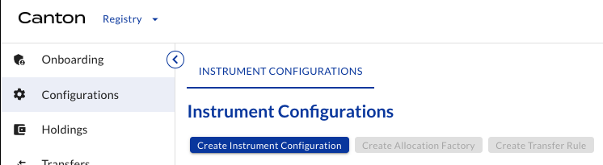

# Demo Issuance - November, 2025 <!-- omit in toc -->

## Table of Contents <!-- omit in toc -->

- [Documentation](#documentation)
- [URLs \& Versions](#urls--versions)
- [PartyIDs](#partyids)
- [Status](#status)
  - [Step 1: Onboarding roles](#step-1-onboarding-roles)
  - [Step 2: Configuring tokens](#step-2-configuring-tokens)
  - [Step 3: Issuing tokens](#step-3-issuing-tokens)
  - [Step 4: Transfering tokens](#step-4-transfering-tokens)
- [Detailed instructions](#detailed-instructions)
  - [1.1 Credential User Service for all entities](#11-credential-user-service-for-all-entities)
  - [1.2 Registrar credential](#12-registrar-credential)
  - [1.3 Registrar onboarding](#13-registrar-onboarding)
  - [2.1 Registrar creates Allocation Factory and Transfer Rule](#21-registrar-creates-allocation-factory-and-transfer-rule)
  - [2.2 Registrar specifies Instrument Configuration](#22-registrar-specifies-instrument-configuration)
  - [2.3 Registrar offers credentials to Issuer and Holders](#23-registrar-offers-credentials-to-issuer-and-holders)
  - [3.1 Issuer requests token issuance (minting)](#31-issuer-requests-token-issuance-minting)
  - [3.2 Registrar accepts and tokens are issued](#32-registrar-accepts-and-tokens-are-issued)
  - [3.3 Issuer offers token transfer to DRW](#33-issuer-offers-token-transfer-to-drw)
  - [3.4 DRW accepts transfer](#34-drw-accepts-transfer)
  - [4.1 DRW offers token transfer to Virtu](#41-drw-offers-token-transfer-to-virtu)
  - [4.2 Virtu accepts transfer](#42-virtu-accepts-transfer)

## Documentation

- [Issuing Tokenized Instruments](https://docs.digitalasset.com/utilities/testnet/tutorials/issuance/introduction.html)
- [Transfering Tokenized Instruments](https://docs.digitalasset.com/utilities/testnet/tutorials/transfer/index.html)
- [Redeeming Tokenized Instruments](https://docs.digitalasset.com/utilities/testnet/tutorials/redemption/index.html)

## URLs & Versions

| Entity                      | Details | Utility UI version |
| :-------------------------- | :------ | ------------------ |
| SG Forge (Registrar/Issuer) | [TBC]   | [0.10.2 TBC]       |
| DRW (Investor1)             | [TBC]   | [0.10.2 TBC]       |
| Virtu (Investor2)           | [TBC]   | [0.10.2 TBC]       |

## PartyIDs

| Entity   | Party ID                                                                        |
| :------- | :------------------------------------------------------------------------------ |
| SG Forge | `sgforge::12206c7de045405eb47f7ecfb1fa82665672664e4b9ab350b7064ef7bceb8bc8cbe3` |
| DRW      | `[DRW_Entity::DRW_Node]`                                                        |
| Virtu    | `[Virtu_Entity::Virtu_Node]`                                                    |

## Status

### Step 1: Onboarding roles

| Steps                                                                                        | DA   | SG Forge | DRW  | Virtu |
| :------------------------------------------------------------------------------------------- | :--- | :------- | :--- | :---- |
| [1.1 Credential User Service for all entities](#11-credential-user-service-for-all-entities) | -    | ✅        | 📌    | 📌     |
| [1.2 Registrar credential](#12-registrar-credential)                                         | ✅    | 📌        | -    | -     |
| [1.3 Registrar onboarding](#13-registrar-onboarding)                                         | ✅    | ✅        | -    | -     |

### Step 2: Configuring tokens

| Steps                                                                                                                    | DA   | SG Forge | DRW  | Virtu |
| :----------------------------------------------------------------------------------------------------------------------- | :--- | :------- | :--- | :---- |
| [2.1 Registrar creates Allocation Factory and Transfer Rule](#21-registrar-creates-allocation-factory-and-transfer-rule) | -    | 📌        | -    | -     |
| [2.2 Registrar specifies Instrument Configuration](#22-registrar-specifies-instrument-configuration)                     | -    | 📌        | 📌    | 📌     |
| [2.3 Registrar offers credentials to Issuer and Holders](#23-registrar-offers-credentials-to-issuer-and-holders)         | -    | 📌        | 📌    | 📌     |

### Step 3: Issuing tokens

| Steps                                                                                      | DA   | SG Forge | DRW  | Virtu |
| :----------------------------------------------------------------------------------------- | :--- | :------- | :--- | :---- |
| [3.1 Issuer requests token issuance (minting)](#31-issuer-requests-token-issuance-minting) | -    | -        | 📌    | -     |
| [3.2 Registrar accepts and tokens are issued](#32-registrar-accepts-and-tokens-are-issued) | -    | 📌        | -    | -     |
| [3.3 Issuer offers token transfer to DRW](#33-issuer-offers-token-transfer-to-drw)         | -    | 📌        | -    | -     |
| [3.4 DRW accepts transfer](#34-drw-accepts-transfer)                                       | -    | -        | 📌    | -     |

### Step 4: Transfering tokens

| Steps                                                                            | DA   | SG Forge | DRW  | Virtu |
| :------------------------------------------------------------------------------- | :--- | :------- | :--- | :---- |
| [4.1 DRW offers token transfer to Virtu](#41-drw-offers-token-transfer-to-virtu) | -    | -        | 📌    | -     |
| [4.2 Virtu accepts transfer](#42-virtu-accepts-transfer)                         | -    | -        | -    | 📌     |

## Detailed instructions

### 1.1 Credential User Service for all entities

| Actor        | Module     | Tab        |
| :----------- | :--------- | :--------- |
| All entities | Credential | Onboarding |

All entities `Request Credential User Service`.

See [tutorial](https://docs.digitalasset.com/utilities/testnet/tutorials/issuance/1-onboarding.html#onboarding-credential-services-for-all-entities) for details.

### 1.2 Registrar credential

| Actors                | Module     | Tab                 |
| :-------------------- | :--------- | :------------------ |
| DA, Registar / Issuer | Credential | Credentials, Offers |

DA offers Registrar credential (Credentials tab), and Registrar accepts it (Offers tab):

| Item        | Value                                                                           |
| :---------- | :------------------------------------------------------------------------------ |
| holder      | `sgforge::12206c7de045405eb47f7ecfb1fa82665672664e4b9ab350b7064ef7bceb8bc8cbe3` |
| id          | `SG Forge Registrar Credential`                                                 |
| description | `SG Forge Registrar Credential`                                                 |
| Subject     | `sgforge::12206c7de045405eb47f7ecfb1fa82665672664e4b9ab350b7064ef7bceb8bc8cbe3` |
| Property    | `hasRegistryRole`                                                               |
| Value       | `Registrar`                                                                     |

See [tutorial](https://docs.digitalasset.com/utilities/testnet/tutorials/issuance/1-onboarding.html#provider-offers-registrar-credential)for details.

### 1.3 Registrar onboarding

| Actors       | Module   | Tab        |
| :----------- | :------- | :--------- |
| SG Forge, DA | Registry | Onboarding |

Registrar clicks on `Request Registrar Service`, and DA accepts.

| Item     | Value                                                                                                |
| :------- | :--------------------------------------------------------------------------------------------------- |
| Provider | `DigitalAsset-UtilityOperator::12202679f2bbe57d8cba9ef3cee847ac8239df0877105ab1f01a77d47477fdce1204` |

See [tutorial](https://docs.digitalasset.com/utilities/testnet/tutorials/issuance/1-onboarding.html#registrar-requests-onboarding-as-a-registrar-in-the-registry) for details.

### 2.1 Registrar creates Allocation Factory and Transfer Rule

| Actors   | Module   | Tab           |
| :------- | :------- | :------------ |
| SG Forge | Registry | Configuration |

Registrar clicks on `Create Allocation Factory` and `Create Transfer Rule`.

Both boxes should turn from blue to grey.

### 2.2 Registrar specifies Instrument Configuration

| Actors   | Module   | Tab           |
| :------- | :------- | :------------ |
| SG Forge | Registry | Configuration |

Registrar creates Instrument Configuration:

| Item                        | Value                                                                           |
| :-------------------------- | :------------------------------------------------------------------------------ |
| Instrument ID               | `USDCV-TESTNET`                                                                 |
| Identifiers                 |                                                                                 |
| Source                      | `sgforge::12206c7de045405eb47f7ecfb1fa82665672664e4b9ab350b7064ef7bceb8bc8cbe3` |
| Id                          | `USDCV`                                                                         |
| Scheme                      | DTI                                                                             |
| Requirement for Mint Issuer |                                                                                 |
| Credential Issuer           | `sgforge::12206c7de045405eb47f7ecfb1fa82665672664e4b9ab350b7064ef7bceb8bc8cbe3` |
| Property                    | `isIssuerOf`                                                                    |
| Value                       | `USDCV`                                                                         |
| Requirement for Holders     |                                                                                 |
| Credential Issuer           | `sgforge::12206c7de045405eb47f7ecfb1fa82665672664e4b9ab350b7064ef7bceb8bc8cbe3` |
| Property                    | `isHolderOf`                                                                    |
| Value                       | `USDCV`                                                                         |

See [tutorial](https://docs.digitalasset.com/utilities/testnet/tutorials/issuance/2-credentials.html#registrar-specifying-the-requirement-of-the-bond-token) for details.

### 2.3 Registrar offers credentials to Issuer and Holders

| Actors               | Module     | Tab                 |
| :------------------- | :--------- | :------------------ |
| SG Forge, DRW, Virtu | Credential | Credentials, Offers |

Registrar issues free credentials (Credentials tab), and Issuer, DRW, and Virtu accept them (Offers tab).

Credential to issue USDCV:

| Item        | Value                                                                           |
| :---------- | :------------------------------------------------------------------------------ |
| holder      | `sgforge::12206c7de045405eb47f7ecfb1fa82665672664e4b9ab350b7064ef7bceb8bc8cbe3` |
| id          | `Issuer-USDCV-Issuer`                                                           |
| description | `Issuer-USDCV-Issuer`                                                           |
| Subject     | `sgforge::12206c7de045405eb47f7ecfb1fa82665672664e4b9ab350b7064ef7bceb8bc8cbe3` |
| Property    | `isIssuerOf`                                                                    |
| Value       | `USDCV`                                                                         |

Credentials to hold USDCV:

| Item        | Value                                                                           |
| :---------- | :------------------------------------------------------------------------------ |
| holder      | `sgforge::12206c7de045405eb47f7ecfb1fa82665672664e4b9ab350b7064ef7bceb8bc8cbe3` |
| id          | `Issuer-USDCV-Holder`                                                           |
| description | `Issuer-USDCV-Holder`                                                           |
| Subject     | `sgforge::12206c7de045405eb47f7ecfb1fa82665672664e4b9ab350b7064ef7bceb8bc8cbe3` |
| Property    | `isHolderOf`                                                                    |
| Value       | `USDCV`                                                                         |

| Item        | Value                    |
| :---------- | :----------------------- |
| holder      | `[DRW_Entity::DRW_Node]` |
| id          | `DRW-USDCV-Holder`       |
| description | `DRW-USDCV-Holder`       |
| Subject     | `[DRW_Entity::DRW_Node]` |
| Property    | `isHolderOf`             |
| Value       | `USDCV`                  |

| Item        | Value                        |
| :---------- | :--------------------------- |
| holder      | `[Virtu_Entity::Virtu_Node]` |
| id          | `Virtu-USDCV-Holder`         |
| description | `Virtu-USDCV-Holder`         |
| Subject     | `[Virtu_Entity::Virtu_Node]` |
| Property    | `isHolderOf`                 |
| Value       | `USDCV`                      |

See [tutorial](https://docs.digitalasset.com/utilities/testnet/tutorials/issuance/2-credentials.html#registrar-offers-credential-of-token-issuer-and-holder-to-issuer) for details.

### 3.1 Issuer requests token issuance (minting)

| Actors   | Module   | Tab   |
| :------- | :------- | :---- |
| SG Forge | Registry | Mints |

| Item       | Value                                                                           |
| :--------- | :------------------------------------------------------------------------------ |
| Instrument | `USDCV-TESTNET`                                                                 |
| Amount     | `10000000`                                                                      |
| Registrar  | `sgforge::12206c7de045405eb47f7ecfb1fa82665672664e4b9ab350b7064ef7bceb8bc8cbe3` |
| Reference  | `USDCV-TESTNET $10m issued Nov-2025`                                            |

See [tutorial](https://docs.digitalasset.com/utilities/testnet/tutorials/issuance/3-issuance.html#issuer-requests-token-issuance-minting) for details.

### 3.2 Registrar accepts and tokens are issued

| Actors   | Module   | Tab   |
| :------- | :------- | :---- |
| SG Forge | Registry | Mints |

Registrar accepts and tokens are issued.

See [tutorial](https://docs.digitalasset.com/utilities/testnet/tutorials/issuance/3-issuance.html#registrar-accepts-and-tokens-are-issued) for details.

### 3.3 Issuer offers token transfer to DRW

| Actors   | Module   | Tab      |
| :------- | :------- | :------- |
| SG Forge | Registry | Holdings |

Issuer transfers tokens to DRW. (3 dots menu on the right of the holding / `Transfer` )

| Item       | Value                                                                           |
| :--------- | :------------------------------------------------------------------------------ |
| Send from  | `sgforge::12206c7de045405eb47f7ecfb1fa82665672664e4b9ab350b7064ef7bceb8bc8cbe3` |
| Send to    | `[DRW_Entity::DRW_Node]`                                                        |
| Instrument | `USDCV-TESTNET`                                                                 |
| Amount     | `8000000`                                                                       |
| Reference  | `USDCV-TESTNET $8m placement to DRW`                                            |

See [tutorial](https://docs.digitalasset.com/utilities/testnet/tutorials/issuance/3-issuance.html#issuer-offers-token-transfer-to-investor1) for details.

### 3.4 DRW accepts transfer

| Actors | Module   | Tab       |
| :----- | :------- | :-------- |
| DRW    | Registry | Transfers |

DRW accepts transfer offer. (click on offer, and then on `Accept`)

See [tutorial](https://docs.digitalasset.com/utilities/testnet/tutorials/issuance/3-issuance.html#investor1-accepts-the-transfer-offer-and-tokens-are-transferred) for details.

### 4.1 DRW offers token transfer to Virtu

| Actors   | Module   | Tab      |
| :------- | :------- | :------- |
| SG Forge | Registry | Holdings |

DRW transfers tokens to Virtu. (3 dots menu on the right of the holding / `Transfer` )

| Item       | Value                                          |
| :--------- | :--------------------------------------------- |
| Send from  | `[DRW_Entity::DRW_Node]`                       |
| Send to    | `[Virtu_Entity::Virtu_Node]`                   |
| Instrument | `USDCV-TESTNET`                                |
| Amount     | `3000000`                                      |
| Reference  | `USDCV-TESTNET $3m transfer from DRW to Virtu` |

See [tutorial](https://docs.digitalasset.com/utilities/testnet/tutorials/issuance/3-issuance.html#issuer-offers-token-transfer-to-investor1) for details.

### 4.2 Virtu accepts transfer

| Actors | Module   | Tab       |
| :----- | :------- | :-------- |
| Virtu  | Registry | Transfers |

Virtu accepts transfer offer. (click on offer, and then on `Accept`)

See [tutorial](https://docs.digitalasset.com/utilities/testnet/tutorials/issuance/3-issuance.html#investor1-accepts-the-transfer-offer-and-tokens-are-transferred) for details.
